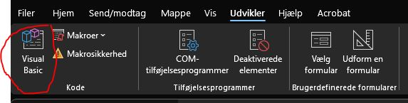
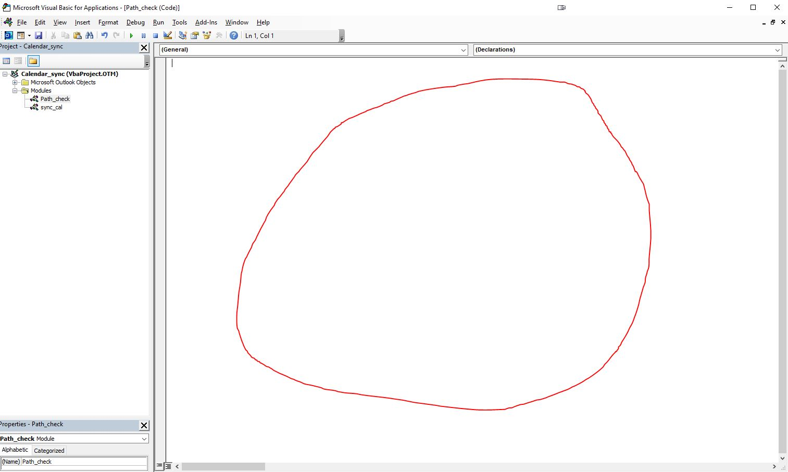
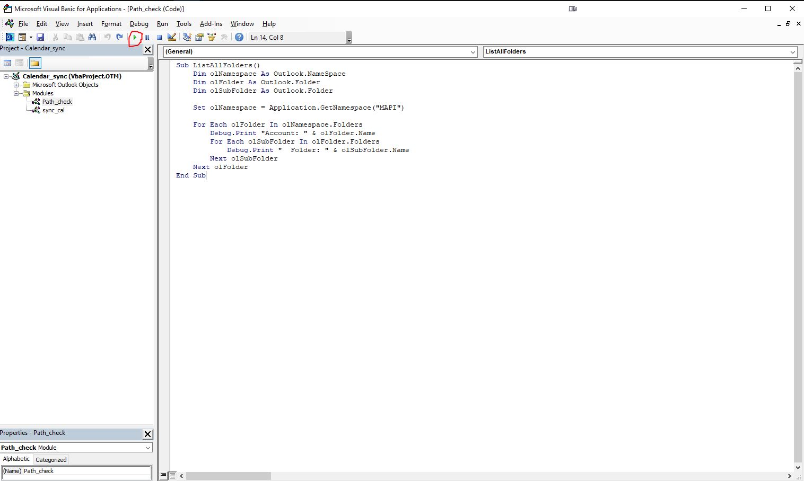
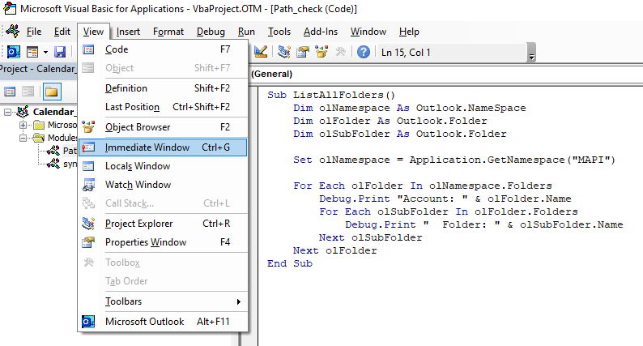
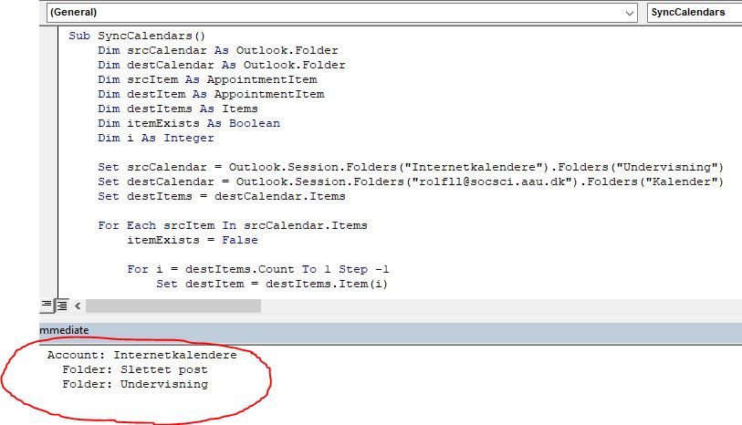
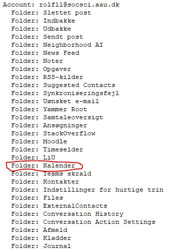
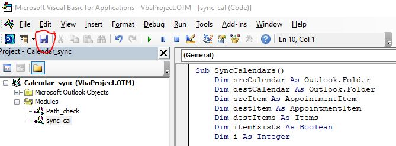

# Sync CalMoodle-calendar with personal calendar

This is a workaround for the problem with having a teaching calendar running from CalMoodle that does not synchronize and auto-update your personal calendar in Outlook. This is mainly made for employees at Aalborg University. The following script(s) does two things:

1.  It checks all paths needed to automate sync
2. It evaluates CalMoodle-objects, adds them to your calendar and upon re-run, it moves all elements that has moved in CalMoodle since last run to their current location

This script is not fool-proof. You will need to manually run it at given intervals because it does not auto-run at CalMoodle changes. Due to AAU security policies, automation has proved difficult but will hopefully be added in the future.


## Table of Contents
1. [User guide](#user-guide)
   1. [Importing the calendar from CalMoodle](#importing-the-calendar-from-calmoodle)
      1. [Getting the calendar from Moodle](#getting-the-calendar-from-moodle)
      2. [Importing the CalMoodle calendar into Outlook](#importing-the-calmoodle-calendar-into-outlook)
   2. [Preparing Outlook for scripts](#preparing-outlook-for-scripts)
      1. [Activating developer mode](#activating-developer-mode)
      2. [Adding modules](#adding-modules)
   3. [Adding the scripts to Visual Basic modules](#adding-the-scripts-to-visual-basic-modules)
   4. [Running scripts](#running-scripts)
      1. [Finding the correct paths](#finding-the-correct-paths)
      2. [Modifying "Module 2"](#modifying-module-2)
      3. [Running the last script](#running-the-last-script)
   5. [For future use](#for-future-use)

## User guide

Below you will find a general user guide for automating calendar synchronization. The guide has been split into different sections to ensure a somewhat smooth setup process. Be advised, that after this has been done once, running the script in the future requires only two clicks with the mouse. It is only the first-time setup that can be a little daunting.


### Importing the calendar from CalMoodle

To ensure that the script has something to synchronize, please make sure that you have imported the CalMoodle calendar into your outlook. If you have done this once, you should be good to go but if you would like to use this as an opportunity to set it up for the first time (or perhaps redo a time where something went wrong) you can follow the guide from here. Be advised that this link will work for all future semesters - it is, as of spring 2024, still specific to your user and will update for future semesters. Thus, no need to do this continuously.

#### Getting the calendar from Moodle

First log into moodle and open CalMoodle in the pane on the left (1), click on "Only show events I am teaching" or "Vis kun begivenheder jeg er tilknyttet som underviser" (2) and then click on "Show iCal URL" or "Vis iCal URL" (3). Picture below for reference:


When clicking on "Show URL", you will be prompted with this box:


Copy the link shown in the prompt and feel free to either close your browser or leave it open if you need to, for some reason, copy the link again. 

#### Importing the CalMoodle calendar into Outlook

Open your calendar via the Outlook application on your computer. When you have opened your main calendar (or basically just any calendar in Outlook), click on the "Open Calendar" or "Åben kalender" and chose the option "From the internet" or "Fra internettet" as shown below:


You will then be prompted with this box:


Paste the link you have found in CalMoodle in the previous step and click "OK". This will now have added a new calendar that you should be able to see in the left bottom pane in your calendars under "Other Calendars" or "Andre Kalendere". The standard naming is something like iCal or "internet calendar" but since that is a bad way of remembering what it does, you should rename it (this will also make a future step easier). To rename the new calendar, navigate to it in the left bottom pane, right-click on it and click "rename" or "omdøb". I have called mine "Undervisning":


 The CalMoodle calendars are now set up the way they need to be for the second step of automation. It does not matter if you look at the calendar or how the calendar is presented in your Outlook, as long as it is visible in the left bottom pane.

### Preparing Outlook for scripts

#### Activating developer mode

To prepare Outlook for scripts, we need to first activate "Developer" or "Udvikler". This sounds more fancy than it actually is. In Outlook, click on the top menu called "Files" or "Filer" and click "Settings" or "Indstillinger" in the very bottom left corner:


With that open, go to "Customize Ribbon" or "Tilpas Båndet" (1) and then make sure that "Developer" or "Udvikler" (2) in the right pane is ticked "on":


Click "OK" and observe that the "Developer" or "Udvikler" menu is visible in the menu selection in Outlook:


Outlook is now ready to add the scripts.

#### Adding modules

In Outlook, click on the new menu "Developer" or "Udvikler" and click "Visual Basic":



This opens a new window called "Windows Visual Basic for Applications". This is where we add our scripts in a little while. First, we prepare the correct modules. Be aware, that below screenshots show the names I have given my elements. The names does not matter one bit. You don't have to give them new names and names like "Module 1" and "Module 2" is just fine. The functionality is EXACTLY the same. Now, in the newly opened window, you have a rather empty, white pane to the left. Right-click anywhere in the empty, white space to the left, navigate to "Insert" and click "Module":


This creates a new folder in the left pane called "Modules" and you should have something called "Module 1". Add another module the exact same way so you have "Module 1" and "Module 2". I have named my modules "Path_check" and "sync_cal" but "Module 1" is just as good:


Now we are ready to add the actual scripts and get the ball rolling. Keep "Microsoft Visual Basic for Applications" open - this is where we will add stuff shortly.

### Adding the scripts to Visual Basic modules

First, you should navigate to [this link](https://github.com/RolfLund/calendar_sync/tree/main/VBA) and click on the "check_paths.bas"-link. This opens code but you can just click on the small icon towards the top with two squares - this copies the code:


Now navigate to the "Microsoft Visual Basic for Applications" and double-click "Module 1" (I have named my Module 1 "Path-check" but please ignore this). This opens up an empty editor where you can paste the code you have coped from "check_paths.bas". Now, please don't run the code (by clicking the small, green arrow in the top) just yet:



The editor will remember the code pasted here so you do not have to worry about saving constantly. Once the code has been added, go back to [this link](https://github.com/RolfLund/calendar_sync/tree/main/VBA) and open the other file called "cal_sync.bas", copy that code as above, go back to "Microsoft Visual Basic for Applications" and paste this code into "Module 2". Now, you should have a shorter code in module 1 and a longer code in module 2.

Now we are ready to actually do some things. 

### Running scripts

For this final step, we are only working in "Microsoft Visual Basic for Applications".

#### Finding the correct paths

First, we have to run the code we saved in "Module 1". Double-click "Module 1" (the one with the short code) and click the small, green arrow (it might appear as if nothing is happening, but there is - you don't have to click a million times... well, you can if you want to, but it would be a waste of time):



To see the output of this script, we need to open something called the "Immediate Window". Click on the "View"-menu and click on "Immediate Window":



This opens up the "Immediate Window" below the open code. You might have to drag the window a little larger to see what is going on. We need to find two pieces of information in the output presented in the "Immediate Window" that should be pasted into the script in "Module 2". You are looking for the following information:

1. The name of the internet calendars. Most of the time, outlook follows windows main language and will simply name this "Internet calendars" or "Internetkalendere" but please make sure. When you have this information, then look at the name presented under that account. If you named your teaching calendar "Teaching" or "Undervisning" this should show up here like so:

   

2. Next, you are looking for the name of the calendar in your main account. Please observe that I am looking only at the folders below my main AAU-account (rolfll@socsci.aau.dk) This should look something like this (same output):



Now, we have all the information we need to modify our last script and finally synchronize our calendars for good.

#### Modifying "Module 2"

In my example, my internet calendar account is called "Internetkalendere" and the folder there is called "Undervisning". My main account is my e-mail and the folder name for my calendar is "Kalender". This is all I need to make the last modification. In "Microsoft Visual Basic for Applications", double click the other module "Module 2" (with the longer code) and before running anything, modify these lines:

```vb
Set srcCalendar = Outlook.Session.Folders("ADD_NAME_INTERNET_CALENDAR").Folders("ADD_NAME_INTERNET_FOLDER")
Set destCalendar = Outlook.Session.Folders("ADD_E-MAIL_HERE").Folders("ADD_NAME_OF_YOUR_MAIN_CALENDAR_HERE")
```

In my case, this would amount to:

``` vb
Set srcCalendar = Outlook.Session.Folders("Internetkalendere").Folders("Undervisning")
Set destCalendar = Outlook.Session.Folders("rolfll@socsci.aau.dk").Folders("Kalender")
```

When all of this is done, you can click on "save" here:



#### Running the last script

When this is all done, you can now press the small green arrow again while "Module 2" is open. This will take a little time the first time the script runs - please be patient. If it takes longer than a few minutes... then probably wait a little longer. Nothing will break or be deleted if this does not work. When it is done, you can close "Microsoft Visual Basic for Applications" and admire a calendar that is perfectly synced with CalMoodle and even includes what room/auditorium you are teaching in or other important comments.

### For future use

After this initial setup, it is amazingly simple to run the script again. You simply go to the "Developer" or "Udvikler" tab, click "Visual Basic", double click "Module 2" and press the small, green arrow. This updates your entire calendar and makes sure that things that have been moved are moved in your calendar as well.

