# Sync CalMoodle-calendar with personal calendar

This is a workaround for the problem with having a teaching calendar running from CalMoodle that does not synchronize and auto-update your personal calendar in Outlook. This is mainly made for employees at Aalborg University. The following script(s) does two things:

1.  It checks all paths needed to automate sync
2. It evaluates CalMoodle-objects, adds them to your calendar and upon re-run, it moves all elements that has moved in CalMoodle since last run to their current location

This script is not fool-proof. You will need to manually run it at given intervals because it does not auto-run at CalMoodle changes. Due to AAU security policies, automation has proved difficult but will hopefully be added in the future.

## User guide

Below you will find a general user guide for automating calendar synchronization. The guide has been split into different sections to ensure a somewhat smooth setup process. Be advised, that after this has been done once, running the script in the future requires only two clicks with the mouse. It is only the first-time setup that can be a little daunting.

### Importing the calendar from CalMoodle

To ensure that the script has something to synchronize, please make sure that you have imported the CalMoodle calendar into your outlook. If you have done this once, you should be good to go but if you would like to use this as an opportunity to set it up for the first time (or perhaps redo a time where something went wrong) you can follow the guide from here. Be advised that this link will work for all future semesters - it is, as of spring 2024, still specific to your user and will update for future semesters. Thus, no need to do this continuously.

#### Getting the calendar from Moodle

First log into moodle and open CalMoodle in the pane on the left (1), click on "Only show events I am teaching" or "Vis kun begivenheder jeg er tilknyttet som underviser" (2) and then click on "Show iCal URL" or "Vis iCal URL" (3). Picture below for reference:

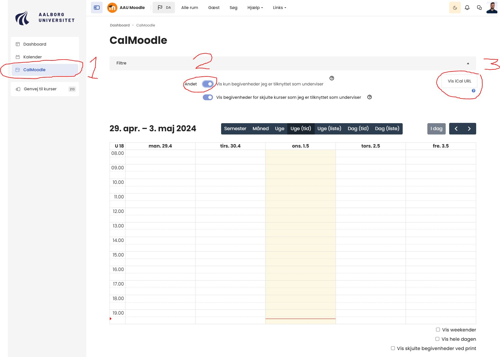

When clicking on "Show URL", you will be prompted with this box:

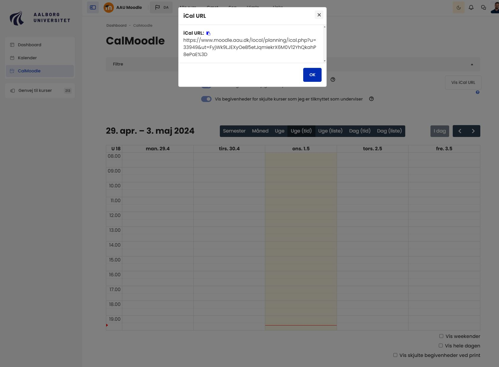

Copy the link shown in the prompt and feel free to either close your browser or leave it open if you need to, for some reason, copy the link again. 

#### Importing the CalMoodle calendar into Outlook

Open your calendar via the Outlook application on your computer. When you have opened your main calendar (or basically just any calendar in Outlook), click on the "Open Calendar" or "Åben kalender" and chose the option "From the internet" or "Fra internettet" as shown below:

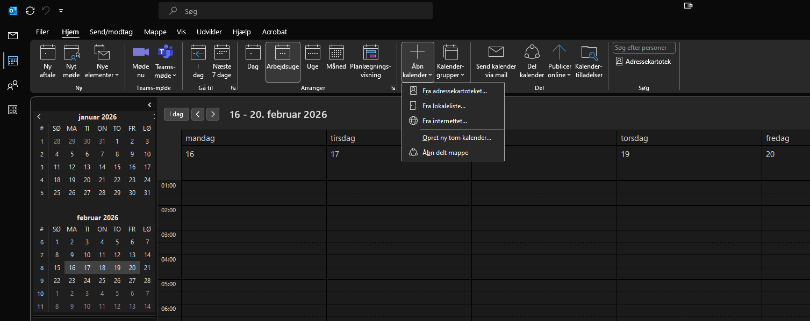

You will then be prompted with this box:

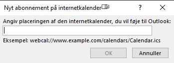

Paste the link you have found in CalMoodle in the previous step and click "OK". This will now have added a new calendar that you should be able to see in the left bottom pane in your calendars under "Other Calendars" or "Andre Kalendere". The standard naming is something like iCal or "internet calendar" but since that is a bad way of remembering what it does, you should rename it (this will also make a future step easier). To rename the new calendar, navigate to it in the left bottom pane, right-click on it and click "rename" or "omdøb". I have called mine "Undervisning":

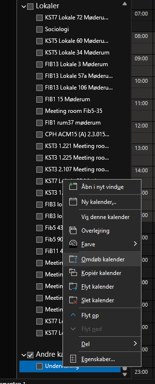

 The CalMoodle calendars are now set up the way they need to be for the second step of automation. It does not matter if you look at the calendar or how the calendar is presented in your Outlook, as long as it is visible in the left bottom pane.

### Preparing Outlook for scripts

#### Activating developer mode

To prepare Outlook for scripts, we need to first activate "Developer" or "Udvikler". This sounds more fancy than it actually is. In Outlook, click on the top menu called "Files" or "Filer" and click "Settings" or "Indstillinger" in the very bottom left corner:

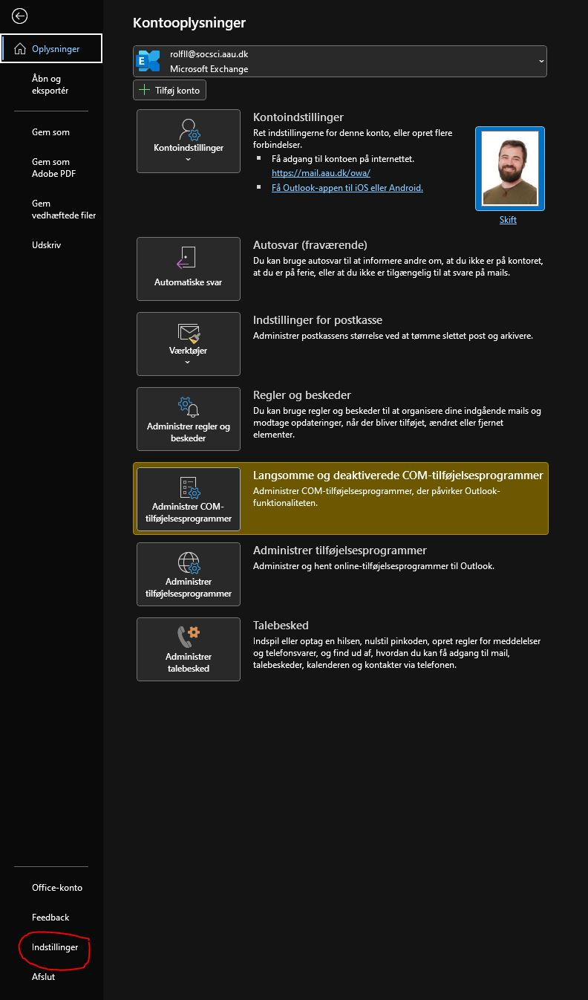

With that open, go to "Customize Ribbon" or "Tilpas Båndet" (1) and then make sure that "Developer" or "Udvikler" (2) in the right pane is ticked "on":

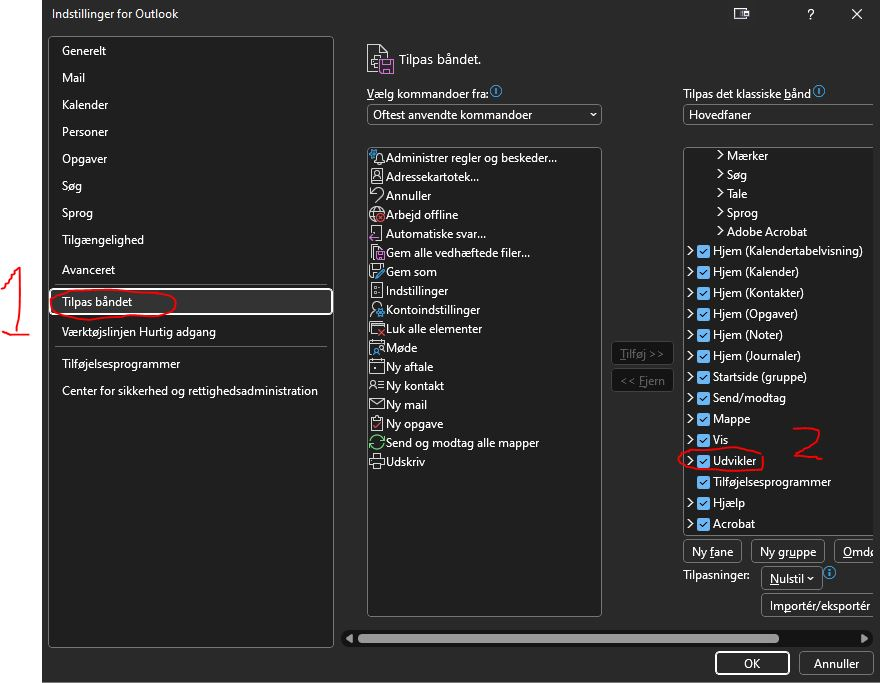

Click "OK" and observe that the "Developer" or "Udvikler" menu is visible in the menu selection in Outlook:

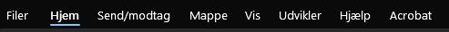

Outlook is now ready to add the scripts.

#### Adding modules

In Outlook, click on the new menu "Developer" or "Udvikler" and click "Visual Basic":

This opens a new window called "Windows Visual Basic for Applications". This is where we add our scripts in a little while. First, we prepare the correct modules. Be aware, that below screenshots show the names I have given my elements. The names does not matter one bit. You don't have to give them new names and names like "Module 1" and "Module 2" is just fine. The functionality is EXACTLY the same. Now, in the newly opened window, you have a rather empty, white pane to the left. Right-click anywhere in the empty, white space to the left, navigate to "Insert" and click "Module":

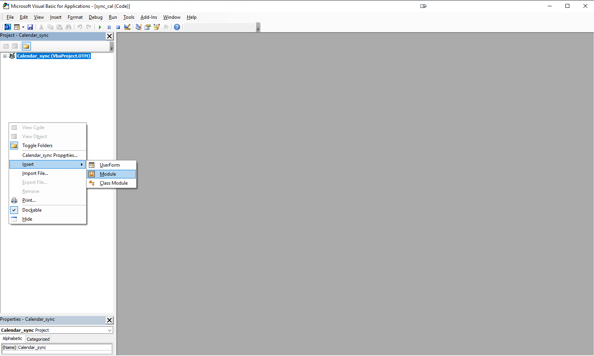

This creates a new folder in the left pane called "Modules" and you should have something called "Module 1". Add another module the exact same way so you have "Module 1" and "Module 2". I have named my modules "Path_check" and "sync_cal" but "Module 1" is just as good:

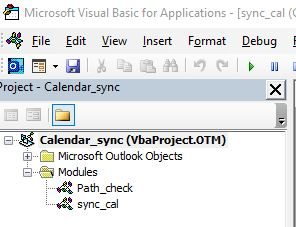

Now we are ready to add the actual scripts and get the ball rolling. Keep "Microsoft Visual Basic for Applications" open - this is where we will add stuff shortly.

### Adding the scripts to Visual Basic modules

First, you should navigate to [this link](https://github.com/RolfLund/calendar_sync/tree/main/VBA) and click on the "check_paths.bas"-link. This opens code but you can just click on the small icon towards the top with two squares - this copies the code:

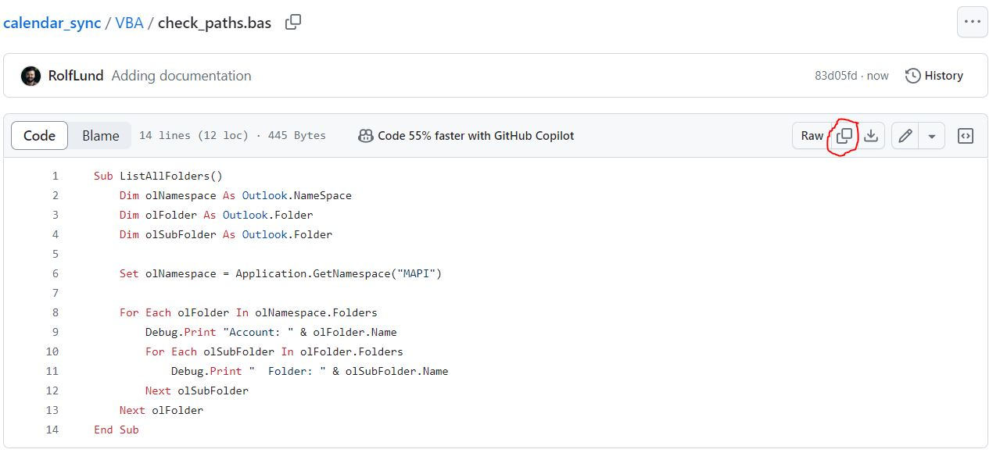

